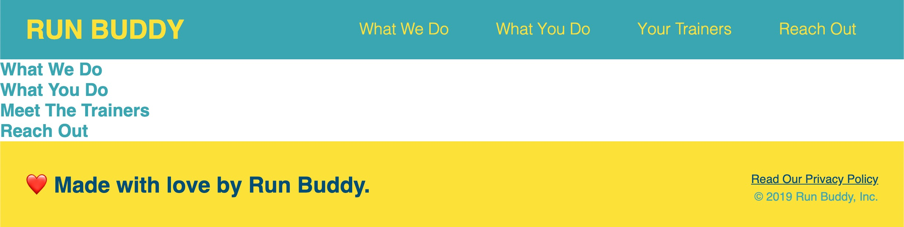
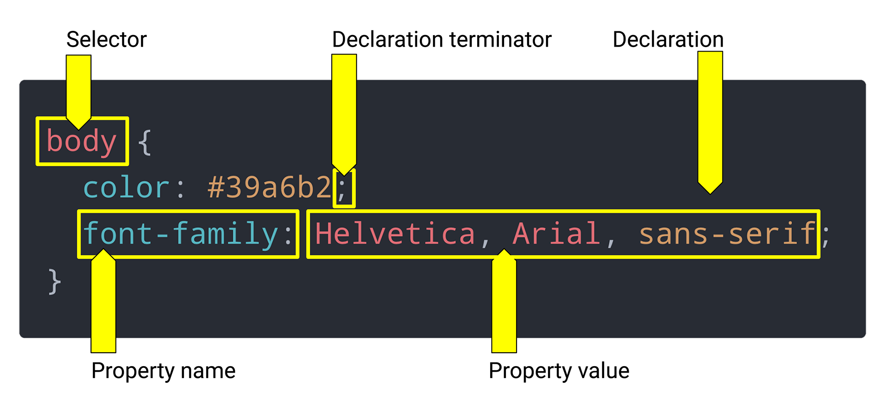

<a href="https://sites.google.com/pannacollege.org/pannacollege/home">

<h1 style="color: brown;">Run-Buddy (Lesson-1.2)</h1>

## သင်ခန်းစာအချိန်ဇယား
- Virtual Class-1 သင်သောအခါ
    1. 01-HTML 
    2. 02-Attributes
    3. Git Guide လေ့လာပြီးဖြစ်ရမည်
- Virtual Class-2 သင်သောအခါ         
    1. 03-CSS-Selectors 
    2. 04-Box-Model
    3. 05-CSS-Positioning လေ့လာပြီးဖြစ်ရမည်
- Challenge assignment ကို နောက်သင်တန်းမစမီ ပြီးအောင်တင်ရမည်<hr>

## ဤသင်ခန်းစာ၌ အသုံးပြုမည့် Tool-များ
- Google Chrome
- Chrome DevTools
- The command line
- Git
- Visual Studio (VS) Code
- GitHub
- GitHub Pages<hr>

## အနှစ်ချုပ်
- CLI အသုံးပြု၍ ဖိုင်နှင့်ဖိုင်တွဲများတည်ဆောက်ပြီး တည်နေရာ၌တည်ရှိရန်
- HTML, CSS ကို စနစ်တကျ တည်ဆောက်ရန်
- Git ကိုအသုံးပြုသိမ်းဆည်း၍ GitHub ပေါ်သို့တင်ရန်
- GitHub pages ဖြင့် အွန်လိုင်းတင်ရန်<hr>

## ပုံစံငယ်
<br><hr>

## သင်ခန်းစာမှ code အချို့
- href="#what-we-do" လို့ <a>မှာရေးလိုက်ရင် လက်ရှိစာမျက်မှာထဲက စာပိုဒ်တစ်ခုမှာ id="what-we-do"လို့ ထည့်လိုက်တာနဲ့ အဲ့ဒီစာပိုဒ်ကို ရောက်သွားမှာပါ။
- href="/" လို့ရေးလိုက်ရင် ရည်ညွှန်းဖိုင်မပါလို့ index.html ဖိုင်ပဲ ပွင့်လာမှာပါ။
- ```<a>```နဲ့ text-decoration တို့ရဲ့အလုပ်လုပ်ပုံ
- float property နဲ့ block or inline element တို့အကြောင်း
- ```*```universal selector နဲ့ margin: 0, padding: 0;အကြောင်း
- HTML entity အကြောင်း၊ ဥပမာ ```&lt;< &gt;> &copy;© &hearts;♥```
- body width 100% ရှိတယ်၊ နောက်တစ်နေရာရာမှာ padding ဘယ်ညာကို ထပ်ယူမယ်ဆိုရင် 100% ကိုကျော်သွားပါပြီ၊ ဒီအခါမှာ ​```*```ထဲမှာ box-sizing: border-box; လို့ထည့်ရေးပေးလိုက်ရင် parentရဲ့ 100% မကျော်ဘဲတွက်သွားမှာပါ။
- box-sizing:မှာ content-size နဲ့ border-box ဆိုပြီးနှစ်မျိုးရှိတယ်၊ content-size မှာတော့ border နဲ့ padding ကိုထပ်ပြီးထည့်တွက်ရမှာပါ။ border-box-ကတော့ border နဲ့ padding-ကို parent-ထဲထည့်ပြီးတွက်သွားမှာပါ။

## သင်ခန်းစာမှ ပုံစံငယ်အချို့
<br><hr>
<br><hr>

## မှတ်ချက်
* HTML-နဲ့ ရိုးရှင်းပြီး သပ်ရပ်တဲ့ ဒီဇိုင်းကို ရေးပါ။ ပြီးမှ CSS-နဲ့ လိုအပ်တာတွေကို ပြင်ပါ။
* CSS-ကိုရေးတဲ့အခါ inline style နဲ့ external link ဆိုပြီးနှစ်မျိုးရှိမယ်၊ inline-style-ဆိုတာ HTML ကုတ်ထဲမှာပဲ 
- inline style
    1. ```<h1 style="color: red">```လို့ရေးနည်းရယ်
    2. ```<style> h1{color: red;} </style>``` လို့ နှစ်မျိုးရှိတယ်။
- external link
    1. external link-ကတော့ သီးသန့် style.css ဖိုင်တစ်ခုခွဲပြီးရေးမယ်၊ ပြီးမှ HTML-ထဲက ```<head>```ထဲမှာ link-css နဲ့တွဲပေးလိုက်ပါ။ ဒီးနည်းက ပိုပြီးသပ်ရပ်သန့်ရှင်းပြီး စနစ်ကျပါတယ်။
* Cascade ဆိုတာ အောက်ပါ(၃)ချက်ကိုလုပ်ဆောင်ပါတယ်
    1. Importance: !important-ကို property-declaration အဆုံးမှာထည့်သုံးသည်
    2. Specificity: ```<h1>```ဆိုရင် အားလုံးသော```<h1>```တွေနဲ့ဆိုင်ပြီး  ```header <h1>```ဆိုရင်တော့ headerအောက်က ```<h1>```နဲ့ပဲသက်ဆိုင်ပါတယ်။
    3. Source Order: css-က အပေါ်ကနေ အောက်ကိုဖတ်တာဖြစ်လို့ ပထမ```<h1>```မှာ အနီရောင်လုပ်ခဲ့သော်လဲ ဒုတိယ```<h1>```မှာ အစိမ်းရောင်လုပ်မယ်ဆိုရင် အစိမ်းရောင်ပဲ ဖြစ်သွားမှာပါ။

<br>
<a href="https://sites.google.com/pannacollege.org/pannacollege/home"></a><br>
<a href="https://sites.google.com/pannacollege.org/pannacollege/home">© PannaCollege</a>
