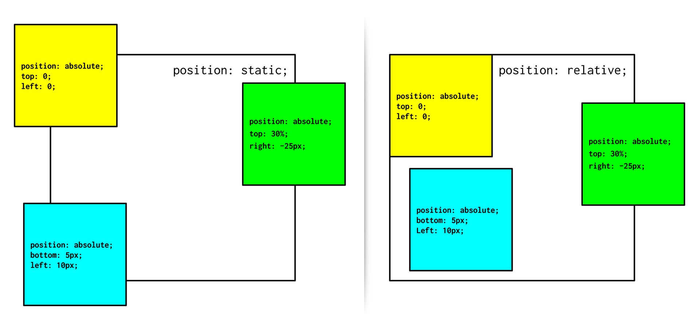

<a href="https://sites.google.com/pannacollege.org/pannacollege/home">
# Run-Buddy (Lesson-1.3)

## သင်ခန်းစာအချိန်ဇယား
- Virtual Class-1 သင်သောအခါ
    1. 01-HTML
    2. 02-Attributes
    3. Git Guide လေ့လာပြီးဖြစ်ရမည်
- Virtual Class-2 သင်သောအခါ         
    1. 03-CSS-Selectors 
    2. 04-Box-Model
    3. 05-CSS-Positioning လေ့လာပြီးဖြစ်ရမည်
- Challenge assignment ကို နောက်သင်တန်းမစမီ ပြီးအောင်တင်ရမည်

## ဤသင်ခန်းစာ၌ အသုံးပြုမည့် Tool-များ
- Google Chrome
- Chrome DevTools
- The command line
- Git
- Visual Studio (VS) Code
- GitHub
- GitHub Pages

## အနှစ်ချုပ်
- CLI အသုံးပြု၍ ဖိုင်နှင့်ဖိုင်တွဲများတည်ဆောက်ပြီး တည်နေရာ၌တည်ရှိရန်
- HTML, CSS ကို စနစ်တကျ တည်ဆောက်ရန်
- Git ကိုအသုံးပြုသိမ်းဆည်း၍ GitHub ပေါ်သို့တင်ရန်
- GitHub pages ဖြင့် အွန်လိုင်းတင်ရန်

## ပုံစံငယ်
 

## သင်ခန်းစာမှ code အချို့
- CTA or Sign-Up form တည်ဆောက်ခြင်း
    - label နဲ့ input က အမြဲတွဲနေတယ်၊ label-မှာပါတဲ့ for-က input-မှာရှိတဲ့ id-နဲ့ ချိတ်ထားတယ်၊ ပြီးတော့ name attribute-က form submit-လုပ်လိုက်တဲ့အခါ js-နဲ့ ref လုပ်ဖို့ဖြစ်တယ်။
- radio button-တွေမှာပါတဲ့ name attribute-တွေအားလုံးက တူနေရမယ်
- background-image ရယ်၊ background-size-နဲ့ background-position-တွေအကြောင်း သိထားနားလည်ရန်
- CSS Box-Model အကြောင်း

- CSS Position အကြောင်းကို လေ့လာရန်
    - static, relative, absolute, fixed, sticky

- <a href="https://developer.mozilla.org/en-US/docs/Web/CSS/display">display အကြောင်းများ</a> (ဥပမာ block, inline, inline-block, flex, grid, etc)
- Chrome DevTools ကိုအသုံးပြုပြီး HTML CSS တို့ကို ခဏတာကာလ၌ စမ်းသပ်ခြင်း

 
 
<a href="https://sites.google.com/pannacollege.org/pannacollege/home">© PannaCollege</a>
