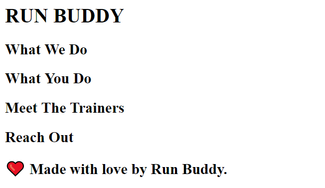
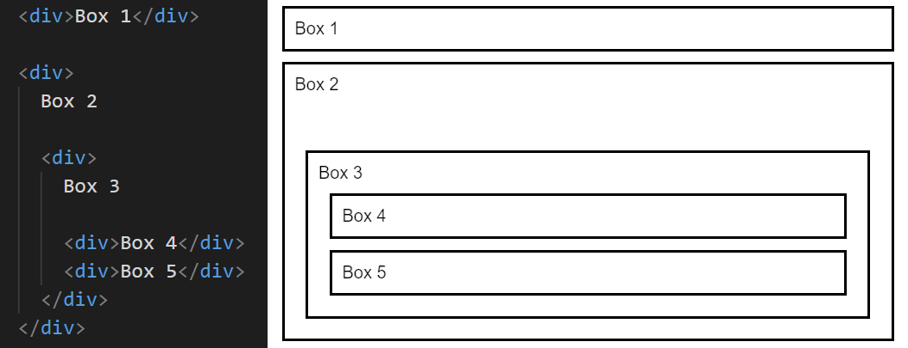
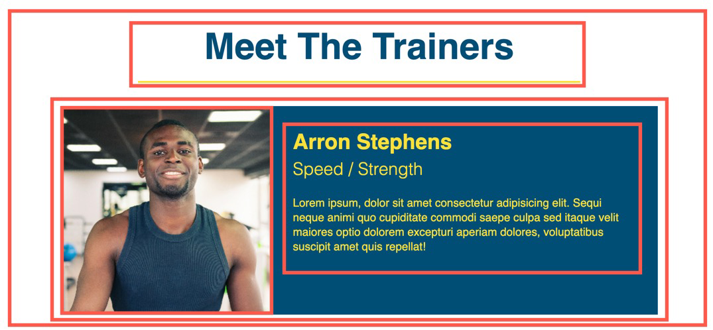

# Run-Buddy (Lesson-1.1)

## သင်ခန်းစာအချိန်ဇယား
- Virtual Class-1 သင်သောအခါ
    1. 01-HTML
    2. 02-Attributes
    3. Git Guide လေ့လာပြီးဖြစ်ရမည်
- Virtual Class-2 သင်သောအခါ         
    1. 03-CSS-Selectors 
    2. 04-Box-Model
    3. 05-CSS-Positioning လေ့လာပြီးဖြစ်ရမည်
- Challenge assignment ကို နောက်သင်တန်းမစမီ ပြီးအောင်တင်ရမည်

## ဤသင်ခန်းစာ၌ အသုံးပြုမည့် Tool-များ
- Google Chrome
- Chrome DevTools
- The command line
- Git
- Visual Studio (VS) Code
- GitHub
- GitHub Pages

## အနှစ်ချုပ်
- CLI အသုံးပြု၍ ဖိုင်နှင့်ဖိုင်တွဲများတည်ဆောက်ပြီး တည်နေရာ၌တည်ရှိရန်
- HTML ကို စနစ်တကျ တည်ဆောက်ရန်
- Git ကိုအသုံးပြုသိမ်းဆည်း၍ GitHub ပေါ်သို့တင်ရန်
- GitHub pages ဖြင့် အွန်လိုင်းတင်ရန်

## ပုံစံငယ်
 

## သင်ခန်းစာမှ ပုံစံငယ်အချို့
 

© PannaCollege
